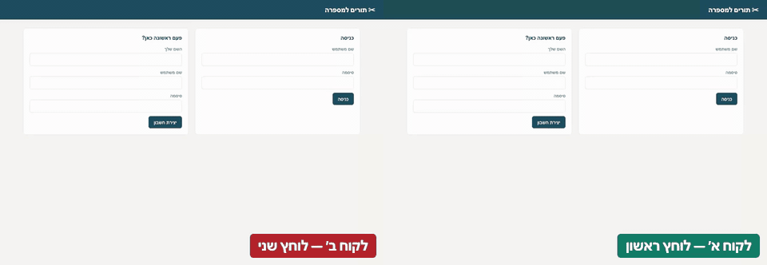

# Barber Booking API

[](https://github.com/DorGodin/barber-booking-api/actions/workflows/ci.yml)

A small, real appointment booking API for a barbershop, with a booking page in Hebrew:
barbers, services, working hours, availability, bookings and cancellations - and an owner's
screen to run the shop. The page is built for a phone as much as a desktop, and is tested on
both, in Safari's engine (WebKit) and in Chromium.



*Two customers, one free 10:00. The first is booked; the second is told the time has just gone.
Recorded by the outside UI suite in [qa-api-starter](https://github.com/DorGodin/qa-api-starter).*

It exists to be tested **from the outside**. It has no test hooks — no reset endpoint, no
back door — so a test framework pointed at it has to work the way it would against any
real product. Its companion is [qa-api-starter](https://github.com/DorGodin/qa-api-starter).

[עברית למטה](#עברית)

---

## Start

```bash
cp .env.example .env
make install
make run
```

Open **http://127.0.0.1:8100** for the booking page, in Hebrew, right to left — sign in as the
seeded customer, pick a barber, a service and a day, and book. The API's interactive docs are at
http://127.0.0.1:8100/docs.

The shop is open **Sunday to Thursday, 10:00 to 19:00**. The first start seeds it, with the
passwords from `.env`:

| Username | Who | Works |
|---|---|---|
| `owner` | בעל המספרה | everything: services, barbers, hours, time off, cancel any booking |
| `barber` | אבי | every day the shop is open |
| `barber.yossi` | יוסי | Sunday, Tuesday, Thursday |
| `barber.moran` | מורן | Monday, Wednesday |
| `barber.ron` | רון | Sunday, Monday, Tuesday |
| `customer` | דנה | a customer with nothing booked |
| `yael` | יעל | a customer who already holds a haircut every two hours with each barber for the next working days |

Signed in as the owner, the same page becomes the management screen: each barber's weekly
hours and days off, a new barber, the services and their prices, and every booking with a
cancel that works even inside the 24 hours.

So every day has a different line-up, and each barber's day shows free and taken times
alternating. The barbers share the barber password and the customers the customer one: sign
in as דנה in one window and יעל in another, choose the same time in both, and press Book in
each — one gets the green popup, the other the red "השעה כבר תפוסה".

Anyone can sign up as another customer with `POST /customers`.

---

## The rules

These are what makes a booking product hard to get right — and what is worth testing.

| Rule | Refused with |
|---|---|
| Two customers cannot book overlapping times with the same barber — even when they press "Book" in the same second | `409 slot_taken` |
| A customer cannot be in two chairs at once, even with two different barbers | `409 customer_overlap` |
| A booking must fit entirely inside the barber's working hours. Closing at 19:00, a 30 minute haircut can start at 18:30, not 18:45 | `422 outside_hours` |
| Back-to-back is allowed: 10:00–10:30 and 10:30–11:00 do not overlap | — |
| Bookings start on the quarter hour | `422 not_aligned` |
| A start time must carry a UTC offset. `10:00` alone means a different moment in every time zone | `422` |
| Not in the past, and at most 60 days ahead | `422 in_past` / `beyond_window` |
| Nothing on a barber's day off | `422 barber_off` |
| A customer can cancel up to 24 hours before. The owner can cancel any time | `409 late_cancellation` |
| A double tap with the same `Idempotency-Key` books once | the first booking, again |
| Changing a price does not change bookings already made | — |
| Somebody else's booking is *not found*, not *forbidden* — a 403 would confirm it exists | `404` |

Every refusal is `{"detail": "...", "code": "..."}`. Branch on `code`; the wording can change.

**Daylight saving is handled, not assumed.** Opening hours are local time, and slots are
computed as real UTC instants between local opening and closing. So the spring-forward day
has 23 hours and no 02:30, the fall-back day has 25 hours and 01:30 twice, and 09:00 opening
is 06:00 UTC in summer and 07:00 UTC in winter. Every booking shows both `start` (UTC) and
`start_local` (with its offset).

---

## Endpoints

| Method | Path | Who |
|---|---|---|
| POST | `/auth/token` | anyone |
| POST | `/customers` | anyone — sign up |
| GET | `/me` | signed in |
| GET | `/services` | signed in |
| POST / PATCH | `/services`, `/services/{id}` | owner |
| GET | `/barbers` | signed in |
| POST | `/barbers` | owner |
| GET / PUT | `/barbers/{id}/hours` | signed in / owner |
| GET / POST / DELETE | `/barbers/{id}/time-off`, `/barbers/{id}/time-off/{date}` | owner |
| GET | `/barbers/{id}/availability?date=&service_id=` | signed in |
| POST | `/bookings` | customer |
| GET | `/bookings`, `/bookings/{id}` | signed in — each sees only their own |
| POST | `/bookings/{id}/cancel` | the customer who booked, or the owner |
| GET | `/shop` | anyone — the shop's time zone, today on its clock, the window and the cutoff |
| GET | `/` | anyone — the booking page |
| GET | `/health` | anyone |

---

## Two copies: one for you, one for the tests

```bash
make run        # http://127.0.0.1:8100 - yours, to click through
make run-test   # http://127.0.0.1:8101 - for the QA suites, with its own database
```

The QA suites in qa-api-starter create barbers, customers, services and bookings on every
run, and the product cannot delete them. Pointed at the copy you use, they bury it - one
afternoon left 720 barbers and 363 services in the owner's screen. So they run against a
second copy on 8101 with its own database file, `barber-test.db`, and never touch yours.
`make reset-test-db` empties the test copy; `make reset-db` empties yours.

## Tests

```bash
make test
```

The product's own tests: the scheduling rules including both DST transitions, the booking
rules through the API, and a **race against a real server running two worker processes** —
twelve customers booking one slot at once must produce exactly one booking, eleven clean
refusals, and not a single server error.

The deep QA suites live in qa-api-starter, which tests this API the way it would test any
product: through its URL, and nothing else.

---

## Sign-in and the page

- **Guessing is limited.** 5 wrong passwords for one account from one address, or 20 from one
  address for any accounts, refuse sign-in for 15 minutes — the right password too — with
  `429 too_many_attempts` and `Retry-After`. The account count is per address, so nobody can lock
  the owner out of the shop from somewhere else. Unknown usernames are counted like real ones.
  The limits are `LOGIN_MAX_FAILURES`, `LOGIN_MAX_FAILURES_PER_IP` and `LOGIN_LOCK_MINUTES`.
- **Behind a proxy, set `FORWARDED_ALLOW_IPS`** to the proxy's address. Without it every client
  arrives as the proxy, and 20 failures from anyone would lock everyone out. uvicorn takes the
  client's address from `X-Forwarded-For` only from the addresses listed there (by default only
  127.0.0.1), so the header cannot be forged from outside.
- **The page has a Content-Security-Policy.** Its own inline script and style run, by sha256, and
  nothing else: no `'unsafe-inline'`, no other origin. The sign-in is kept in `sessionStorage`,
  which survives a refresh but not closing the tab; the policy is what stops an injected script
  from reading it.
- **Signing out ends the sign-in on the server.** Every token carries a `jti`; `POST /auth/logout`
  revokes it, so a copy taken before the sign-out is refused at once. Other sign-ins stay.
- **Dependencies are audited.** pip-audit runs on every push and every night
  (`.github/workflows/dependencies.yml`), and Dependabot proposes every upgrade.
- **An accessibility statement** is at `/accessibility`, linked from every screen. Fill in
  `ACCESSIBILITY_*` in `.env` with the shop's real contact and premises before going live.
- **The page meets WCAG 2.2 AA and works from the keyboard alone.** The times are a radio group:
  one Tab stop, the arrows to move (the left arrow is the next time, the page reads right to
  left), Home and End. After a booking or a cancellation the focus goes to that booking.

## How it prevents double booking

A booking is check-then-insert: is the slot free? then take it. Two requests can both check,
both see it free, and both take it. So the check and the insert run inside one database
transaction that takes the write lock **at its start** (`BEGIN IMMEDIATE`). The second
request waits, and its check then sees the first request's booking.

A lock in Python memory would not do: it protects one process, and the server runs two.

---

<a id="עברית"></a>

## עברית

API קטן ואמיתי לקביעת תורים במספרה: ספרים, שירותים, שעות עבודה, זמינות, הזמנות וביטולים —
עם מסך הזמנה בעברית שמתאים גם לטלפון.

הוא קיים כדי שיבדקו אותו **מבחוץ**. אין בו שום "קיצור" לבדיקות — אין endpoint לאיפוס, אין
דלת אחורית — כך שתשתית בדיקות שמופנית אליו צריכה לעבוד בדיוק כמו מול כל מוצר אמיתי. התשתית
שבודקת אותו היא [qa-api-starter](https://github.com/DorGodin/qa-api-starter).

### הפעלה

```bash
cp .env.example .env
make install
make run
```

פותחים את **http://127.0.0.1:8100** כדי להגיע למסך ההזמנה — מתחברים כלקוח, בוחרים ספר, שירות
ויום, ומזמינים. המסך בנוי לטלפון בדיוק כמו למחשב, ונבדק על שניהם — ב-WebKit, המנוע של Safari, וב-Chromium. התיעוד האינטראקטיבי של ה-API נמצא ב-http://127.0.0.1:8100/docs.

המספרה פתוחה **בימים א׳–ה׳, 10:00–19:00**. בהפעלה הראשונה נוצרים: בעל המספרה (`owner`); ארבעה
ספרים — אבי (`barber`, כל יום), יוסי (`barber.yossi`, א׳ ג׳ ה׳), מורן (`barber.moran`, ב׳ ד׳) ורון
(`barber.ron`, א׳ ב׳ ג׳); ושתי לקוחות — דנה (`customer`) ויעל (`yael`), שכבר מחזיקה תספורת כל שעתיים
אצל כל ספר בימי העבודה הקרובים. כך בכל יום יש הרכב ספרים אחר, ובכל יום רואים שעות פנויות ותפוסות
לסירוגין. אפשר להתחבר כדנה בחלון אחד וכיעל בחלון אחר, לבחור את אותה שעה בשניהם וללחוץ "קביעת התור"
בכל אחד — אחד יקבל חלון ירוק, והשני חלון אדום "השעה כבר תפוסה". בעל המספרה שמתחבר מקבל את מסך
הניהול: שעות עבודה וימי חופש לכל ספר, ספר חדש, שירותים ומחירים, וביטול כל תור — גם פחות מ-24 שעות
לפני. כל אחד יכול להירשם כלקוח נוסף דרך
`POST /customers`.

### החוקים

אלה הדברים שעושים מוצר של תורים לקשה — ושכדאי לבדוק:

| חוק | נדחה עם |
|---|---|
| שני לקוחות לא יכולים לקבוע זמנים חופפים אצל אותו ספר — גם כשהם לוחצים "הזמן" באותה שנייה | `409 slot_taken` |
| לקוח לא יכול לשבת בשני כיסאות בבת אחת, גם אצל שני ספרים שונים | `409 customer_overlap` |
| תור חייב להיכנס כולו לשעות העבודה. סוגרים ב-19:00? תספורת של 30 דקות מתחילה ב-18:30, לא ב-18:45 | `422 outside_hours` |
| תור צמוד לתור מותר: 10:00–10:30 ו-10:30–11:00 לא חופפים | — |
| תורים מתחילים ברבע שעה | `422 not_aligned` |
| שעת התחלה חייבת לכלול הפרש מ-UTC. "10:00" לבד זה רגע אחר בכל אזור זמן | `422` |
| לא בעבר, ולכל היותר 60 יום קדימה | `422 in_past` / `beyond_window` |
| שום תור ביום חופש של הספר | `422 barber_off` |
| לקוח יכול לבטל עד 24 שעות לפני. הבעלים יכול לבטל תמיד | `409 late_cancellation` |
| לחיצה כפולה עם אותו `Idempotency-Key` מזמינה פעם אחת | ההזמנה הראשונה, שוב |
| שינוי מחיר לא משנה הזמנות שכבר נעשו | — |
| הזמנה של מישהו אחר *לא נמצאה*, ולא *אסורה* — 403 היה מאשר שהיא קיימת | `404` |

כל דחייה מחזירה `{"detail": "...", "code": "..."}`. מחליטים לפי `code`; הניסוח יכול להשתנות.

**שעון קיץ מטופל, לא מנוחש.** שעות הפתיחה הן בשעון המקומי, והתורים מחושבים כרגעים אמיתיים
ב-UTC בין הפתיחה לסגירה. לכן ביום המעבר לשעון קיץ יש 23 שעות ואין 02:30, ביום החזרה יש 25
שעות ו-01:30 פעמיים, ופתיחה ב-09:00 היא 06:00 UTC בקיץ ו-07:00 UTC בחורף.

### שני עותקים: שלך, ושל הבדיקות

```bash
make run        # http://127.0.0.1:8100 - שלך, כדי ללחוץ ולנסות
make run-test   # http://127.0.0.1:8101 - לסוויטות ה-QA, עם מסד נתונים משלו
```

סוויטות ה-QA ב-qa-api-starter יוצרות ספרים, לקוחות, שירותים ותורים בכל ריצה, והמוצר לא יכול
למחוק אותם. אם הן רצות על העותק שאתה עובד בו, הן קוברות אותו — אחר צהריים אחד השאיר 720 ספרים
ו-363 שירותים במסך הבעלים. לכן הן רצות על עותק שני בפורט 8101, עם קובץ מסד נתונים משלו
(`barber-test.db`), ולא נוגעות בשלך. `make reset-test-db` מנקה את עותק הבדיקות; `make reset-db`
מנקה את שלך.

### בדיקות

```bash
make test
```

הבדיקות של המוצר עצמו: חוקי התזמון כולל שני ימי המעבר של שעון קיץ, חוקי ההזמנה דרך ה-API,
ו**מרוץ מול שרת אמיתי שרץ בשני תהליכים** — שנים עשר לקוחות שמזמינים את אותו תור באותו רגע
חייבים לקבל הזמנה אחת בדיוק, אחת עשרה דחיות נקיות, ואף לא שגיאת שרת אחת.

סוויטות ה-QA המעמיקות נמצאות ב-qa-api-starter, שבודק את ה-API הזה כמו שהוא בודק כל מוצר: דרך
הכתובת שלו, ותו לא.

### החיבור והדף

- **ניחוש סיסמאות מוגבל.** 5 סיסמאות שגויות לחשבון אחד מכתובת אחת, או 20 מכתובת אחת לחשבונות כלשהם,
  חוסמים כניסה ל-15 דקות — גם עם הסיסמה הנכונה — עם `429 too_many_attempts` ו-`Retry-After`. הספירה
  לחשבון היא לפי כתובת, כך שאף אחד לא יכול לנעול את בעל המספרה מחוץ למספרה ממקום אחר. שם משתמש שלא
  קיים נספר כמו שם אמיתי. הגבולות: `LOGIN_MAX_FAILURES`, `LOGIN_MAX_FAILURES_PER_IP`, `LOGIN_LOCK_MINUTES`.
- **מאחורי proxy צריך להגדיר `FORWARDED_ALLOW_IPS`** לכתובת שלו. בלי זה כל הלקוחות מגיעים בכתובת של
  ה-proxy, ו-20 כישלונות של מישהו אחד ינעלו את כולם. uvicorn לוקח את הכתובת מ-`X-Forwarded-For` רק
  מהכתובות שברשימה (כברירת מחדל רק 127.0.0.1), כך שאי אפשר לזייף אותה מבחוץ.
- **לדף יש Content-Security-Policy.** רק ה-script וה-style של הדף עצמו רצים, לפי sha256, ושום דבר
  אחר: בלי `'unsafe-inline'` ובלי מקור אחר. החיבור נשמר ב-`sessionStorage`, ששורד רענון אבל לא סגירת
  לשונית; המדיניות היא מה שמונע מ-script מוזרק לקרוא אותו.
- **יציאה מסיימת את החיבור גם בשרת.** לכל token יש `jti`, ו-`POST /auth/logout` מבטל אותו, כך שעותק
  שנלקח לפני היציאה נדחה מיד. החיבורים האחרים נשארים.
- **התלויות נסרקות.** pip-audit רץ בכל push ובכל לילה (`.github/workflows/dependencies.yml`),
  ו-Dependabot מציע כל שדרוג.
- **הצהרת נגישות** נמצאת ב-`/accessibility`, עם קישור מכל מסך. לפני שעולים לאוויר צריך למלא ב-`.env`
  את `ACCESSIBILITY_*` בפרטי הקשר ובתיאור המקום האמיתיים של המספרה.
- **הדף עומד ב-WCAG 2.2 AA ועובד מהמקלדת בלבד.** השעות הן קבוצת radio: עצירת Tab אחת, החצים כדי לזוז
  (החץ השמאלי הוא השעה הבאה, כי הדף מימין לשמאל), ו-Home ו-End. אחרי הזמנה או ביטול המיקוד עובר להזמנה.

### איך נמנעת הזמנה כפולה

הזמנה היא "בדוק ואז הכנס": האם התור פנוי? אם כן, קח אותו. שתי בקשות יכולות לבדוק יחד, לראות
שהוא פנוי, ולקחת אותו שתיהן. לכן הבדיקה וההכנסה רצות בתוך טרנזקציה אחת שנועלת את מסד הנתונים
**כבר בתחילתה** (`BEGIN IMMEDIATE`). הבקשה השנייה מחכה, והבדיקה שלה כבר רואה את ההזמנה של
הראשונה.

נעילה בזיכרון של פייתון לא הייתה מספיקה: היא מגינה על תהליך אחד, והשרת מריץ שניים.
